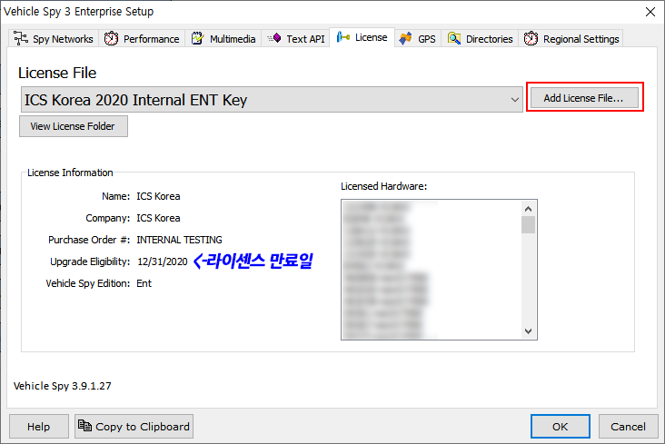

# Vehicle Spy 3 Quick Start

프로그램 최초 실행 시에는 라이센스 파일 등록이 필요합니다. 아래 화면의 _Add License File_ 버튼을 눌러 구입 시에 제공받은 .lic파일을 등록합니다. 라이센스 등록 후 라이센스 만료일도 함께 확인 하실 수 있으며 이 때부터 프로그램을 정상적으로 사용 가능합니다.

<figure> Options > License 탭"><figcaption>
Tools > Options > License 탭
</figcaption></figure>

라이센스 관련 문의 사항이 있으시다면 [기술 지원](../기술-지원.md)팀에 연락주시기 바랍니다.
