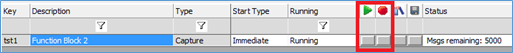
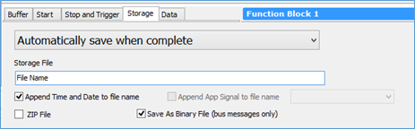
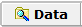

# Capture Function Block을 이용한 메세지 저장법

어플리케이션에 따라 원하는 설정으로 메세지를 로깅할 수 있는 기능입니다.

1. Scripting and Automation->Function Blocks 메뉴 좌측 상단의버튼을 누르고 Capture를 선택하여 Capture Function Block을 생성합니다.
2. Buffer탭에서 Filters… 버튼을 눌러 내가 원하는 메세지만 선택하여 받을 수 있습니다. (모든 데이터를 저 장할 때에는 설정할 필요는 없습니다.) Filters... 사용은 [메세지 모니터링](../시작하기/메세지-모니터링.md)의 커스텀 필터 설정 부분을 참조하시기 바랍니다.
3. Start탭에서 로깅 시작 시점을 설정합니다.

<figure><figcaption></figcaption></figure>

&#x20; 각 항목이 의미하는 바는 다음과 같습니다.

* Start Immediately: Online과 동시에 시작
* Manual Start: 수동으로 시작 (아래 Function Block 시작 버튼을 누르거나 Graphical Panel 또는 다른 Function Block을 통해 시작할 때 사용.)

<figure><figcaption></figcaption></figure>

* Use Start Expression: 지정한 수식이 참이 되었을 때 시작

<figure><figcaption></figcaption></figure>

* Start Immediately Embedded Only: 장비에 이 Capture Function Block을 이식한 후에 장비 전원이 들어 왔을 때 바로 동작하는 방식 (PC에서는 동작하지 않음)

&#x20; 4\. Stop and Trigger탭에서 로깅 정지 시점 또는 트리거 시점을 설정합니다. 각 항목의 의미하는 바는 \
&#x20;     다음과 같습니다.

* Collect in a circular buffer: ‘Messages’ 창에서 저장하는 것처럼 링 버퍼를 사용하여 ‘Buffer Size’의 크기 만큼 최근 메세지가 저장 됩니다. (즉, 50000으로 설정을 했을 때 최근에 들어온 메세지 50000개만 저장 이 됩니다.)
* Collect in a one-shot buffer: 메세지 저장이 시작된 이후 해당 설정 크기까지만 저장이 됩니다.
* Collect before and after a trigger expression: 지정한 수식이 참이 되었을 시점의 앞 뒤를 로깅합니다.

&#x20; 5\. Storage탭에서 로깅된 데이터의 저장 시점과 파일 포맷을 지정합니다. Automatically save when\
&#x20;     complete 또는 Stream to disk로 설정하여 사용하면 됩니다.

<figure><figcaption></figcaption></figure>

위 4가지 설정을 하셨으면 Online하셔서 원하시는 설정으로 데이터를 저장하시면 되고 저장된 경로는 우측 상단의 버튼을 클릭하시면 해당 경로가 나오게 됩니다.


**주로 많이 사용하는 저장 설정 (장기간 PC 에서 메세지 저장을 할 때)**

1. ‘Start’ 항목에서 ‘Manual Start’로 설정 후 Start/Stop Hotkey를 원하시는 키로 설정합니다. 그리고 가장 중 요한 ‘Automatically restart when complete’ 체크박스를 꼭 선택합니다.
2. ‘Stop and Trigger’ 항목에서 ‘Collect in a one-shot buffer’로 설정하고 Buffer Size를 한 파일당 저장할 메 세지의 개수로 입력을 합니다.
3. ‘Storage’ 항목에서 ‘Automatically save when complete’로 설정하고 Storage File에서 해당 파일명을 입력 합니다.
4. 위 설정을 다 했다면 Online을 하신 후 설정한 Hotkey버튼을 눌러 저장을 시작하고 다 하셨으면 다시 한 번 눌러 저장을 정지하면 됩니다.

