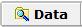

# Logging 메뉴에서 신호 저장법

PC에서 설정하신 신호만 저장하는 방법에 관한 내용으로써 먼저 _Measurement -> Logging_으로 이동합니다.  .png>)버튼을 클릭하면 아래와 같은 창이 나오게 됩니다.

<figure><figcaption></figcaption></figure>

먼저 Signal Group Name에 선택되는 신호 그룹의 이름을 입력합니다. 그런 후 신호를 선택하기 위해서 화면의 좌측 편에서 신호가 있는 곳을 선택해 줍니다. 예를 들어 .dbc 파일을 등록 하셨다면 ‘Database’를 선택하시면 되고 직접 메세지를 만들어서 신호를 정의 하셨다면 ‘Rx Messages’나 ‘Tx Messages’로 이동하시면 원하시는 신 호를 찾을 수 있으실 것입니다. 찾을 때 편리한 기능은 ‘Find’라고 적힌 곳에 해당 이름을 입력하시거나 해당 ID 를 입력하시면 손쉽게 원하시는 신호를 찾으실 수 있습니다. 신호를 찾은 후 더블 클릭을 하시거나 좌측 상단에 있는 ‘+’버튼을 누르시면 현재 창의 상단에 해당하는 신호가 추가가 되고 ‘-’버튼을 클릭하면 해당 신호를 삭제 하실 수 있습니다. 또한 ‘↑’와 ‘↓’버튼을 이용하여 신호의 순서도 정하실 수 있습니다.

다 선택하신 뒤(OK버튼을 눌러서 나오신 다음) ‘Log This Signal Group’의 체크 박스를 선택해 주신 뒤 아래 항 목들에 관해서 설정을 해주시면 됩니다.

<figure><figcaption></figcaption></figure>

각 항목들에 대해서 설명 드리겠습니다.

* Log at Constant Rate: 아래 Log Rat(초 단위)에 선택한 주기마다 모든 신호의 값을 저장
* Log All Updates: 선택한 신호들 중 신호의 값이 장비를 통해 들어올 때마다 각각의 신호가 저장
* Save when data changes only: 신호의 값이 변경될 때 마다 저장
* Log file: 파일의 이름 설정하는 곳
* Log File Creation Options: 파일이 저장될 때 이름에 시작한 시간을 표시하는 설정

아래의 ‘Start Logging’란과 ‘Stop Logging’란은 기본으로 ‘Online’과 동시에 데이터가 저장이 되고 ‘Offline’하면 데이터가 저장이 멈추도록 설정되어 있습니다. 만약 특정 이벤트가 발생한 뒤 시작을 원하신다면‘Start Logging’란에서 ‘Start On Equation’를 선택 후 ! .png>)버튼을 눌러 원하시는 이벤트를 설정하시면 됩니다. (직접 버튼을 눌러 시작하시기를 원하신다면 .png>)버튼을 누른 후 ‘Expression’에 “0”을 입력하셔서 ‘Online’후 ‘Start Logging’버튼을 눌러 데이터를 저장 하실 수 있습니다.)

Vehicle Spy 3 우측 상단에 있는 버튼을 클릭하면 데이터 저장 경로가 열립니다.
