# 장비 단독으로 메세지 저장법

장비를 PC에 연결하지 않고 장비 단독으로 데이터를 저장할 수 있는 방법에 대해 소개합니다. 여러 조건의 데이터 저장 방법을 병렬로 동시에 실행할 수 있습니다.

_Measurement->Vehicle Scape DAQ_로 이동합니다. 또는 아래의 _File->Logon_ 화면에서 _VehicleScape DAQ_ 버튼 을 클릭합니다.

<figure>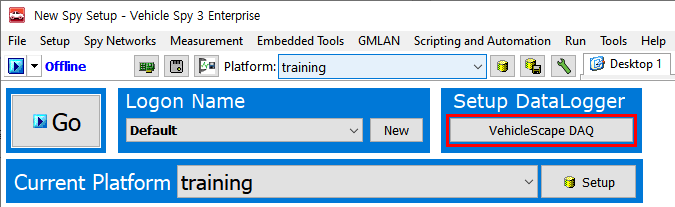<figcaption>
File->Logon
</figcaption></figure>

### 하드웨어 설정 및 데이터 베이스 확

아래 그림의 빨간 박스 부분에 알맞은 데이터베이스(dbc, odx, a2l등)가 불러와졌는지 다시 한 번 확인합니다. 필요한 경우 해당 버튼을 눌러 데이터 베이스를 추가합니다.

dbc, ldf, arxml 파일 추가 방법은 [여기](../vehicle-spy-3-quick-start/데이터베이스-플랫폼-생성-및-데이터베이스dbc-ldf-arxml-등록.md)를 참고하시기 바랍니다.

<figure>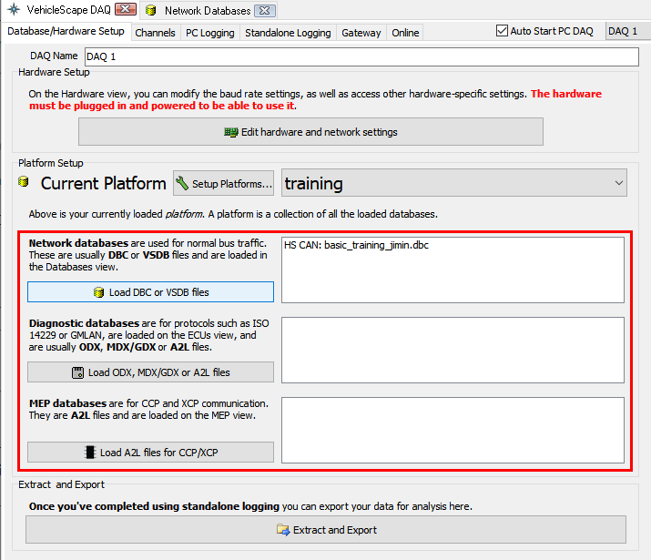<figcaption>
<em>Measurement->Vehicle Scape DAQ</em>
</figcaption></figure>

### 장비 단독 로깅 설정

데이터베이스 설정을 확인 했다면, _Standalone Logging_탭으로 이동합니다. 여기서 로깅을 어떻게 할 지 설정할 수 있습니다.

<figure>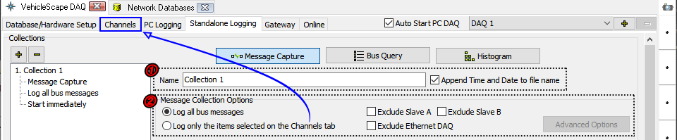<figcaption>
<em>Measurement->Vehicle Scape DAQ->Standalone Logging</em>탭
</figcaption></figure>

1. 로그 파일의 이름을 설정합니다. _Append Time and Date to file name_ 체크박스를 선택하면 파일이 저장되는 시점의 시간과 함께 파일 이름이 생성됩니다.
2. 어떤 메세지를 저장할지를 선택합니다. _Log all bus messages_를 선택 시 장비로 들어오는 모든 메세지 가 저장 되며 _Log only the items selected on the Channels tab_를 선택 시 _Channels_ 탭에서 선택된 시그 널만 저장됩니다.

_Channels_ 탭을 잠시 살펴보겠습니다

<figure>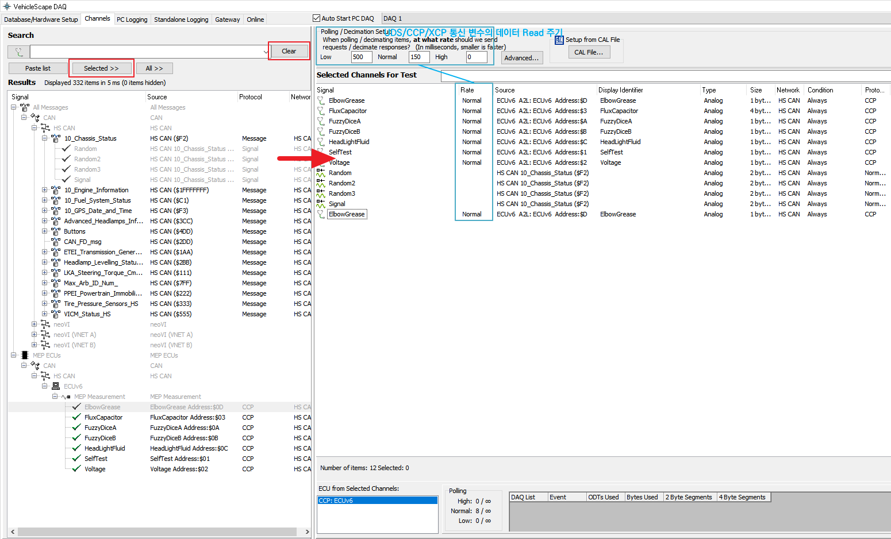<figcaption>
<em>Measurement->Vehicle Scape DAQ->Channels</em> 탭
</figcaption></figure>

_Clear_ 버튼을 누르면 하단 _Results_ 창에 현재 등록된 플랫폼 내의 모든 변수가 출력됩니다. 또는 검색된 변수의 목록이 출력됩니다. 로깅을 원하는 변수를 더블 클릭 또는 드래그로 다중 선택하여 _Selected_ 버튼을 누르면 변 수들이 우측 _Selected Channels for Test_에 추가됩니다.

UDS/CCP/XCP 변수를 로깅할 때에는 상단의 _Polling setup_에서 주기를 설정하고 변수들을 우클릭하여 _Rate_를 _Low/Normal/High_ 중 하나로 선택합니다.

1. 로깅을 시작하는 방법에는 크게 3가지가 있습니다.

<figure>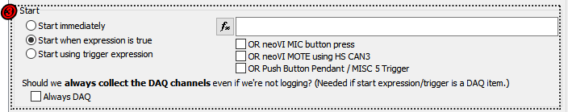<figcaption>
<em>Measurement->Vehicle Scape DAQ->Standalone Logging</em>탭
</figcaption></figure>

* Start immediately: 장비에 전원이 들어오는 즉시 데이터를 저장을 시작하는 방법
* Start when expression is true: 특정 이벤트가 발생 했을 시 데이터를 저장을 시작하는 방법

"Start when expression is true"를 선택하면 오른쪽 편에 수식공간이 생기고 그 아래에 3가지를 선택할 수 있는 체크박스가 나오게 됩니다.

먼저 버튼을 눌러서 수식이 참이 될 때 데이터를 저장하는 방법이 있고 아래 체크박스에 설정된 장비를 이 용하여 데이터 저장의 시작점을 정할 수 있습니다.

수식을 설정하는 방법은 다음과 같습니다.

.png>)버튼을 누르게 되면 아래 화면이 나옵니다

<figure>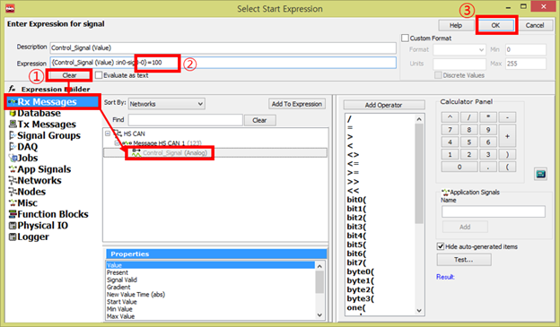<figcaption></figcaption></figure>

위의 화면처럼 어떤 신호가 100의 값을 가지면 종료를 하고자 할 때를 가정하여 설명 드리겠습니다.\
먼저 ‘Description’과 ‘Expression’란에 값이 들어가 있다면 ‘Clear’버튼을 눌러서 그 값들을 지웁니다. 그런 다음 선택할 신호가 있는 경로로 이동합니다. (현재 ‘Messages Editor’창의 ‘Rx Messages’에 추가한 신호를 선택, 만약 등록한 .dbc 나 .ldf 파일에 신호를 선택하길 원한다면Rx Messages’아래에 있는 ‘Database’를 선택) 찾은 신호를 더블 클릭하면 위와 같이 ’Expression’란에 “{**신호이름**과 관련위치}”(Ex. {**Control\_Signal (Value)** :in0-sig0-0})라는 신호가 입력됩니다. 그런 뒤 위의 화면처럼 해당 수식을 직접 입력해주면 됩니다. (위의 화면 에서는 “=100”을 직접 입력 했습니다.)\
‘Description’은 말 그대로 이름을 정하는 것이기 때문에 크게 신경 쓰지 않으셔도 됩니다. 마지막으로 ‘OK’버튼 을 클릭하시면 됩니다.\
‘Add Operator’에 보면 사용할 수 있는 다양한 수식이 나와있으니 참고 하시면 됩니다. 또한 수식 관련 설명은 위의 ‘Help’버튼을 이용하시면 확인하실 수 있습니다.

체크 박스 설명

* OR neoVI MIC button press: neoVI MIC 장비의 버튼을 눌러 데이터 저장을 시작
* OR neoVI MOTE using HS CAN3(neoVI 3G): neoVI MOTE 장비의 버튼을 이용하여 데이터 저장 시작
* &#x20;OR Push Button Pendant/ MISC 5 Trigger: MISC 5를 이용하여 데이터 저장 시작

‘OR neoVI MOTE using HS CAN3(neoVI 3G)’의 체크박스를 선택하면 아래에 neoVI MOTE 체크박스가 선택되고 아래에서 관련한 옵션을 설정하실 수 있습니다. (보통 기본 설정된 방식으로 사용하시면 됩니다.) 현재 위의 화 면에는 HS CAN3라인에 NeoVI MOTE를 연결하여 동작하도록 설정되어 있습니다.

* Start using trigger expression: 특정 이벤트가 발생 시점으로 전과 후의 데이터를 저장하는 방법

<figure>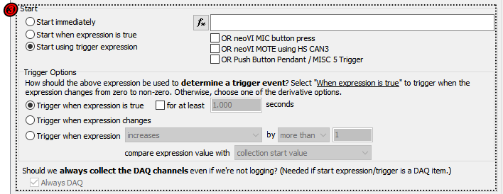<figcaption></figcaption></figure>

4\. 로깅을 중단하는 방법에 대한 옵션은 로깅 시작 방법(과정 3)에 따라 달라집니다. 로깅 시작 방법(과정 3) 으로 Start immediately나 Start when expression is true를 선택하게 되면, 아래와 같이 나옵니다.

<figure>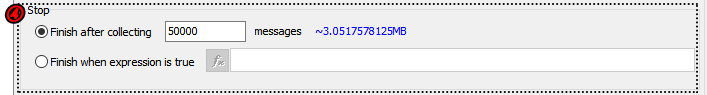<figcaption></figcaption></figure>

'Finish after collecting \~ messages'를 선택하면, 입력한 수 만큼 메세지 로깅 후 종료합니다. 'Restart the collection when finished'를 선택하면 우측의 수식이 참이 되었을 때 로깅을 종료합니다. 수식을 설정하는 방법은 여기를 참고해주세요.

로깅 시작 방법(3)을 Start using trigger expression로 선택하면, 아래와 같이 나옵니다.

<figure><figcaption></figcaption></figure>

‘Pre/Post Collection’을 선택하면 수식이 참이 되었을 경우 전후로 설정한 만큼 데이터를 저장하게 됩니다. 아래 항목에서 장비의 sd 카드 사이즈에 맞게 Card Size를 조절하고, 시간(By time)으로 전과 후를 저장할 것인지 메 세지의 개수(By number of messages)로 전과 후를 저장할 것인지 선택 할 수 있고 그에 따라 우측에서 정확한 시간이나 개수를 정할 수 있습니다. 그리고 상단 가운데 있는 ‘One-shot Report’를 선택하면 수식이 참이 되었 을 때 ‘Channels’탭에서 선택된 신호나 메세지를 한번만 저장하게 됩니다.

&#x20;5\. 4번 과정에서 로깅 중단 지점을 설정하였는데 데이터 저장이 끝났을 때 다시 로깅 시작 조건(2)을 기다릴 지 아니면 데이터 저장을 완전히 종료할지 선택할 수 있습니다.

<figure>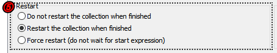<figcaption></figcaption></figure>

이외에 사용되는 각종 다양한 기능들을 설명 드리겠습니다.

* 동시에 여러 개의 데이터 저장방식을 설정하는 방법

<figure>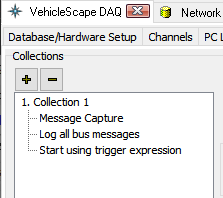<figcaption></figcaption></figure>

좌측 상단의 ‘+’버튼을 이용하여 새로운 데이터 저장방식을 만들어 병렬로 여러 개의 각기 다른 데이터 저장을 동시에 하실 수 있습니다.

* 차량의 시동이 꺼졌을 때 로거 장비에 사용되는 차량 배터리를 절약하는 방법(Sleep mode)

<figure>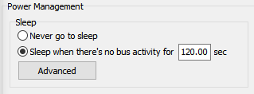<figcaption></figcaption></figure>

Power Management에서 'Never go to sleep'은 어떠한 상태에서도 데이터를 저장하는 설정이고, 'Sleep when there's no bus activity'로 설정하면 입력한 초 만큼 장비로 메세지가 들어오지 않는 경우 장비가 대기 모드로 들 어가고 메세지가 들어오게 되면 다시 메세지를 저장하게 됩니다.

모든 설정을 마치셨다면 마지막으로 Status reporting 부분의 LEDs 체크박스가 체크 되어 있는지 확인해주시고 (로거 상태 확인을 용이하게 하는 옵션) 가장 아래에 있는 _Generate_ 버튼을 눌러줍니다.

<figure>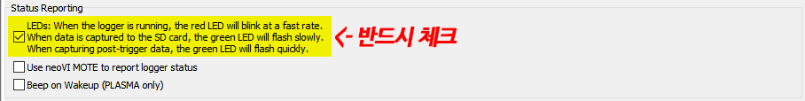<figcaption></figcaption></figure>

### 장비에 설정 이식(Coremini Console)

<figure>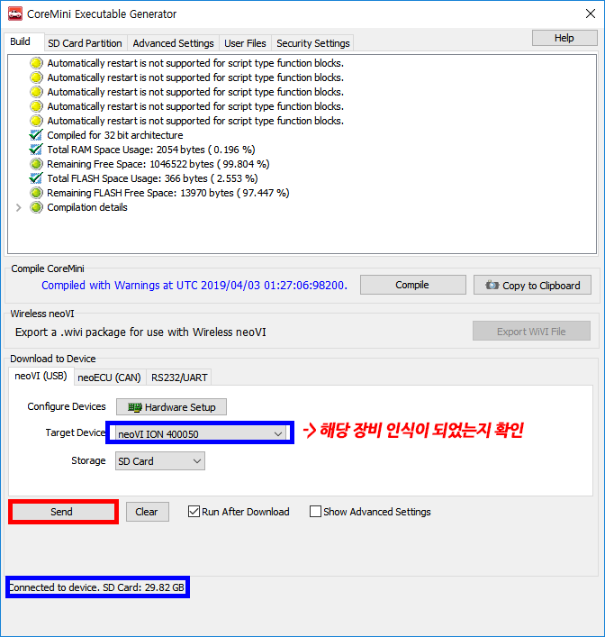<figcaption></figcaption></figure>

그러면 위와 같은 창이 뜨게 됩니다.

먼저 ‘Target Devices’에서 내가 사용할 장비의 이름과 S/N가 맞는지 확인해 줍니다. 그리고 ‘Storage’가 ‘SD Card’로 선택되어 있는지도 확인해 줍니다. 특별히 확인해 주셔야 할 옵션이 ‘Run After Download’체크 박스인 데 이것이 선택되어 있으면 ‘Send’버튼을 눌러 아래 파란 박스처럼 ‘Success’라고 메세지가 나오는 즉시 바로 데 이터 저장이 시작되고 ‘Run After Download’를 선택하지 않고 ‘Send’를 누르면 바로 실행이 되는 것이 아니라 장비의 전원을 분리했다가 다시 연결한 순간부터 데이터가 저장이 됩니다. 그리고 아래 파란 박스처럼 ‘Send’를 눌렀을 때 ‘Success’ 메세지를 확인하여 장비가 단독으로 사용하는 것이 제대로 설정이 되었는지 최종적으로 확 인을 해 줍니다.

※ 장비의 빨간색 LED가 2-3번 깜빡일 동안 초록색 LED가 1번깜빡인다면 제대로 데이터 저장이 되고 있다는 것 을 의미합니다.

led 점멸에 따른 상태는 [여기](https://cdn.intrepidcs.net/support/neoVIHardware/FIREneoLEDBlink.htm)서 자세히 확인 가능합니다.
