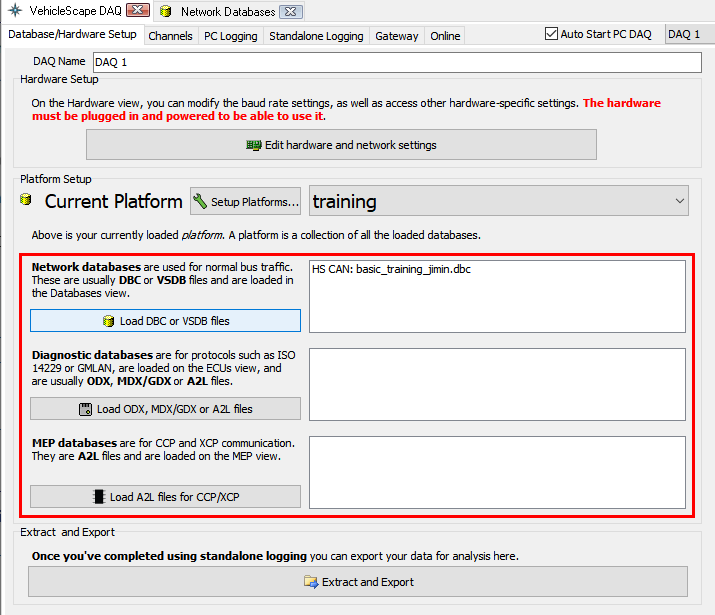

# 장비 단독으로 메세지 저장법

장비를 PC에 연결하지 않고 장비 단독으로 데이터를 저장할 수 있는 방법에 대해 소개합니다. 여러 조건의 데이터 저장 방법을 병렬로 동시에 실행할 수 있습니다.

_Measurement->Vehicle Scape DAQ_로 이동합니다. 또는 아래의 _File->Logon_ 화면에서 _VehicleScape DAQ_ 버튼 을 클릭합니다.

<figure><figcaption>
File->Logon
</figcaption></figure>

### 하드웨어 설정 및 데이터 베이스 확인

아래 그림의 빨간 박스 부분에 알맞은 데이터베이스(dbc, odx, a2l등)가 불러와졌는지 다시 한 번 확인합니다. 필요한 경우 해당 버튼을 눌러 데이터 베이스를 추가합니다.

dbc, ldf, arxml 파일 추가 방법은 [여기](../../시작하기/데이터베이스-플랫폼-생성-및-데이터베이스-dbc-ldf-arxml-등록.md)를 참고하시기 바랍니다.

<figure><figcaption>
<em>Measurement->VehicleScape DAQ</em>
</figcaption></figure>
