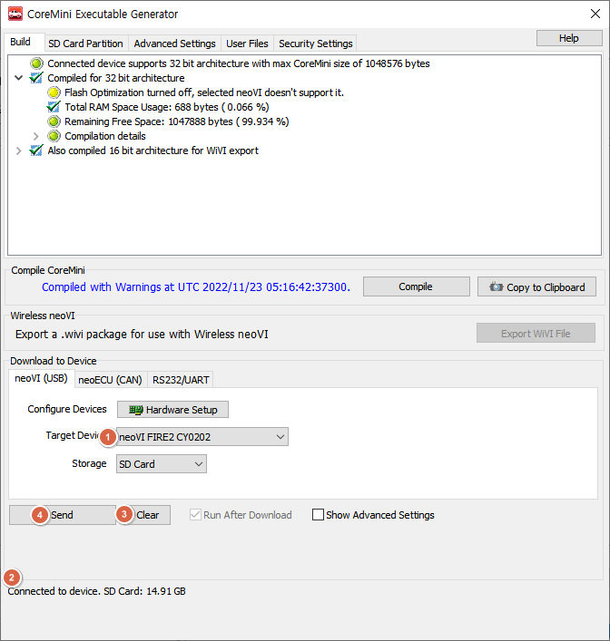

# 장비에 설정 이식(Coremini Console)

<figure><figcaption>
<em>Measurement->VehicleScape DAQ->Standalone Logging</em>탭 최하단의 Generate 클릭
</figcaption></figure>

설정을 마친 후에 최하단의 _Generate_ 버튼을 누르면 위와 같은 창이 뜨게 됩니다.

1. _Target Devices_에서 연결된로거 장비의 이름과 시리얼 번호를 확인합니다.
2. 로거 장비내 SD Card가 잘 인식(Connected to device)되었는지 확인합니다.
3. Clear 버튼을 누르면 SD Card의 모든 내용이 삭제됩니다.
4. Send 버튼을 클릭하여 로거 설정을 이식합니다. 하단에 녹색 Success 문구를 확인합니다.

※ 장비의 빨간색 LED가 2-3번 깜빡일 동안 초록색 LED가 1번 깜빡인다면 제대로 데이터 저장이 되고 있다는 것 을 의미합니다.

led 점멸에 따른 상태는 [여기](https://cdn.intrepidcs.net/support/neoVIHardware/FIREneoLEDBlink.htm)서 자세히 확인 가능합니다.
