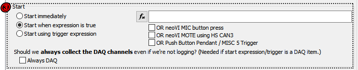
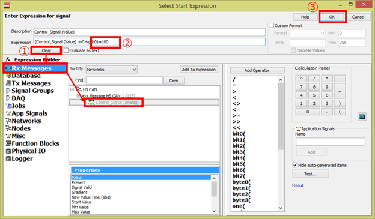
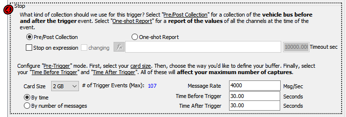
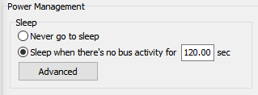
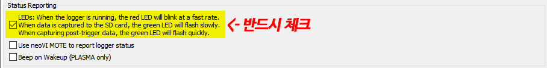

# 장비 단독 로깅 설정

데이터베이스 설정을 확인 했다면, _Standalone Logging_탭으로 이동합니다. 여기서 로깅을 어떻게 할지 설정할 수 있습니다.

<figure><figcaption>
<em>Measurement->VehicleScape DAQ->Standalone Logging</em>탭
</figcaption></figure>

## 1.  로그 파일 이름 설정

_Append Time and Date to file name_ 체크박스를 선택하면 파일이 저장되는 시점의 시간과 함께 파일 이름이 생성됩니다.

## 2. 로깅할 메세지 선택

* _Log all bus messages:_ 장비로 들어오는 모든 메세지 저장
* _Log only the items selected on the Channels tab: Channels_ 탭에서 선택된 시그널만 저장됩니다.

_Channels_ 탭을 잠시 살펴보겠습니다.

<figure><figcaption>
<em>Measurement->Vehicle Scape DAQ->Channels</em> 탭
</figcaption></figure>

_Clear_ 버튼을 누르면 하단 _Results_ 창에 현재 등록된 플랫폼 내의 모든 변수가 출력됩니다. 또는 검색된 변수의 목록이 출력됩니다. 로깅을 원하는 변수를 더블 클릭 또는 드래그로 다중 선택하여 _Selected_ 버튼을 누르면 변수들이 우측 _Selected Channels for Test_에 추가됩니다.

UDS/CCP/XCP 변수를 로깅할 때에는 상단의 _Polling setup_에서 주기를 설정하고 변수들을 우클릭하여 _Rate_를 _Low/Normal/High_ 중 하나로 선택합니다. CCP/XCP 변수를 Event 방식으로 받는 경우 변수들을 우클릭 후 Rate->CCP/XCP DAQ Events에서 Event를 지정합니다. Event별로 할당할 수 있는 ODT 수가 정해져 있으므로 메뉴 우측 하단의 표를 참고하여 이를 초과하지 않도록 지정합니다.

## 3. 로깅 시작 방법 설정

<figure><figcaption>
<em>Measurement->Vehicle Scape DAQ->Standalone Logging</em>탭
</figcaption></figure>

* Start immediately: 장비에 전원이 들어오는 즉시 로깅 시작
* Start when expression is true: 오른쪽 .png>) 수식이 참이 될 때 로깅 시작

## 수식 설정 방법

버튼을 누르게 되면 아래 화면이 나옵니다.

<figure><figcaption></figcaption></figure>

위의 화면처럼 어떤 신호가 100의 값을 가지면 종료를 하고자 할 때를 가정하여 설명 드리겠습니다.\
먼저 ‘Description’과 ‘Expression’란에 값이 들어가 있다면 ‘Clear’버튼을 눌러서 그 값들을 지웁니다. 그런 다음 선택할 신호가 있는 경로로 이동합니다. (현재 ‘Messages Editor’창의 ‘Rx Messages’에 추가한 신호를 선택, 만약 등록한 .dbc 나 .ldf 파일에 신호를 선택하길 원한다면Rx Messages’아래에 있는 ‘Database’를 선택) 찾은 신호를 더블 클릭하면 위와 같이 ’Expression’란에 “{**신호이름**과 관련위치}”(Ex. {**Control\_Signal (Value)** :in0-sig0-0})라는 신호가 입력됩니다. 그런 뒤 위의 화면처럼 해당 수식을 직접 입력해주면 됩니다. (위의 화면에서는 “=100”을 직접 입력했습니다.)\
‘Description’은 말 그대로 이름을 정하는 것이기 때문에 크게 신경쓰지 않으셔도 됩니다. 마지막으로 ‘OK’버튼을 클릭하시면 됩니다.\
‘Add Operator’에 보면 사용할 수 있는 다양한 수식이 나와있으니 참고 하시면 됩니다. 또한 수식 관련 설명은 위의 ‘Help’버튼을 이용하시면 확인하실 수 있습니다.

오른쪽 수식 입력 옵션 아래에 3개의 체크 박스가 있습니다.&#x20;

* OR neoVI MIC button press: neoVI MIC 장비의 버튼을 눌러 데이터 저장을 시작
* OR neoVI MOTE using HS CAN3(neoVI 3G): neoVI MOTE 장비의 버튼을 이용하여 데이터 저장 시작
* &#x20;OR Push Button Pendant/ MISC 5 Trigger: MISC 5를 이용하여 데이터 저장 시작

‘OR neoVI MOTE using HS CAN3(neoVI 3G)’의 체크박스를 선택하면 아래에 neoVI MOTE 체크박스가 선택되고 아래에서 관련한 옵션을 설정하실 수 있습니다. (보통 기본 설정된 방식으로 사용하시면 됩니다.) 현재 위의 화면에는 HS CAN3라인에 NeoVI MOTE를 연결하여 동작하도록 설정되어 있습니다.

* Start using trigger expression: 특정 이벤트가 발생 시점으로 전과 후의 데이터를 저장하는 방법

<figure><figcaption></figcaption></figure>

## 4. 로깅 중단 방법 설정

이 옵션은 로깅 시작 방법(과정 3)에 따라 달라집니다. 로깅 시작 방법(과정 3) 으로 Start immediately나 Start when expression is true를 선택하게 되면, 아래와 같이 나옵니다

'Finish after collecting \~ messages'를 선택하면, 입력한 수 만큼 메세지 로깅 후 종료합니다. 'Restart the collection when finished'를 선택하면 우측의 수식이 참이 되었을 때 로깅을 종료합니다. 수식을 설정하는 방법은 여기를 참고해주세요.

로깅 시작 방법(3)을 Start using trigger expression로 선택하면, 아래와 같이 나옵니다.

<figure><figcaption></figcaption></figure>

‘Pre/Post Collection’을 선택하면 수식이 참이 되었을 경우 전후로 설정한 만큼 데이터를 저장하게 됩니다. 아래 항목에서 장비의 sd 카드 사이즈에 맞게 Card Size를 조절하고, 시간(By time)으로 전과 후를 저장할 것인지 메세지의 개수(By number of messages)로 전과 후를 저장할 것인지 선택할 수 있고 그에 따라 우측에서 정확한 시간이나 개수를 정할 수 있습니다. 그리고 상단 가운데 있는 ‘One-shot Report’를 선택하면 수식이 참이 되었을 때 ‘Channels’탭에서 선택된 신호나 메세지를 한 번만 저장하게 됩니다.

## 5. 로깅 재시작 방법 설정

4번 과정에서 로깅 중단 지점을 설정하였는데 데이터 저장이 끝났을 때 다시 로깅 시작 조건(2)을 기다릴지 아니면 데이터 저장을 완전히 종료할지 선택할 수 있습니다.

<figure><figcaption></figcaption></figure>

이외에 사용되는 각종 다양한 기능들을 설명 드리겠습니다.

* 동시에 여러 개의 데이터 저장 방식을 설정하는 방법

<figure><figcaption></figcaption></figure>

좌측 상단의 ‘+’버튼을 이용하여 새로운 데이터 저장방식을 만들어 병렬로 여러 개의 각기 다른 데이터 저장을 동시에 하실 수 있습니다.

* 차량의 시동이 꺼졌을 때 로거 장비에 사용되는 차량 배터리를 절약하는 방법(Sleep mode)

<figure><figcaption></figcaption></figure>

Power Management에서 'Never go to sleep'은 어떠한 상태에서도 데이터를 저장하는 설정이고, 'Sleep when there's no bus activity'로 설정하면 입력한 초 만큼 장비로 메세지가 들어오지 않는 경우 장비가 대기 모드로 들어가고 메세지가 들어오게 되면 다시 메세지를 저장하게 됩니다.

**마지막으로 **_**Status Reporting**_** 부분의 LEDs 옵션을 반드시 활성화 합니다. 이 옵션은 장비 외부의 LED를 통해 로거 상태를 확인할 수 있게해줍니다.**

<figure><figcaption></figcaption></figure>
