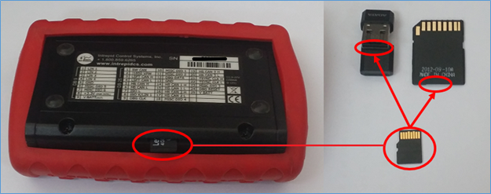

# 장비 단독으로 저장한 데이터 추출

장비 SD Card내에 저장된 데이터를 추출해보겠습니다.

NeoVI FIRE나 RED 제품을 사용 중이신 경우 아래 사진처럼 장비의 SD 카드를 제거하여 SD 카드 리더기를 이용 해 SD 카드를 PC와 연결합니다. 이외에 NeoVI FIRE2 등을 사용하시는 경우 장비에서 SD 카드를 제거할 필요없이 장비가 PC와 연결된 상태에서 그대로 진행하시면 됩니다.

<figure><figcaption></figcaption></figure>
