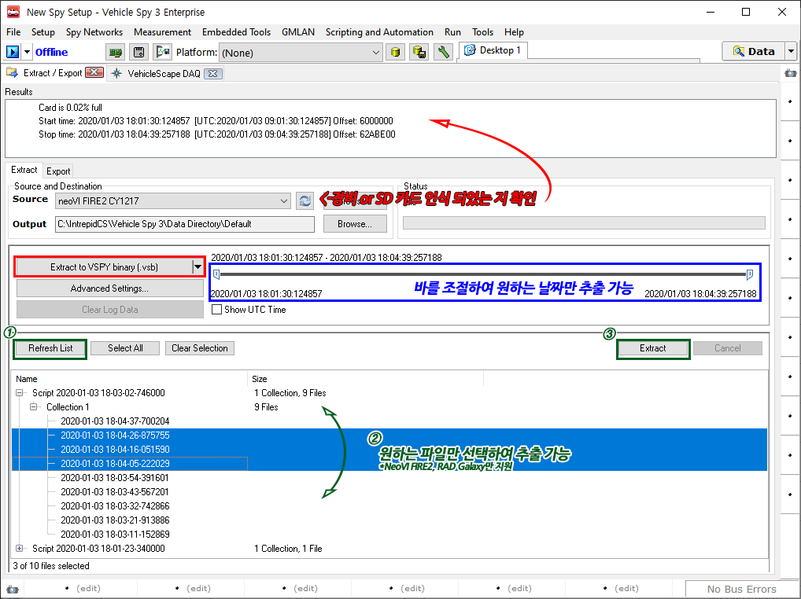

# VSB 파일 추출(3.9.2.19버전 이하)

1. _Tools->Extract/Export_ 메뉴로 이동합니다.
2. _Source_가 올바른 장비 또는 SD 카드로 인식되어있는지 확인합니다. 인식되지 않은 경우 _Refresh_ 버튼을 누르거나 소프트웨어를 재시작해보시기 바랍니다.
3. _Output_으로 추출된 데이터가 저장될 경로를 선택합니다.
4. _Extract to VSPY binary(.vsb)_ 버튼을 클릭하면 누르면 SD 카드에 저장된 데이터가 VSB 파일로 추출됩니다.
   * (아래 스크린샷 상 파란색 부분): 시간 바의 길이를 조절하여 원하는 날짜의 파일만 추출 가능합니다.
   * (아래 스크린샷 상 초록색 부분): _Refresh List_ 버튼을 누르면 SD 카드 내 파일을 확인할 수 있고 원하는 파 일만 선택하여 Extract 버튼으로 추출할 수 있습니다. _이 기능은 NeoVI Fire2, Rad Galaxy 등 상위 제품에서만 지원 됩니다._

<figure><figcaption></figcaption></figure>
