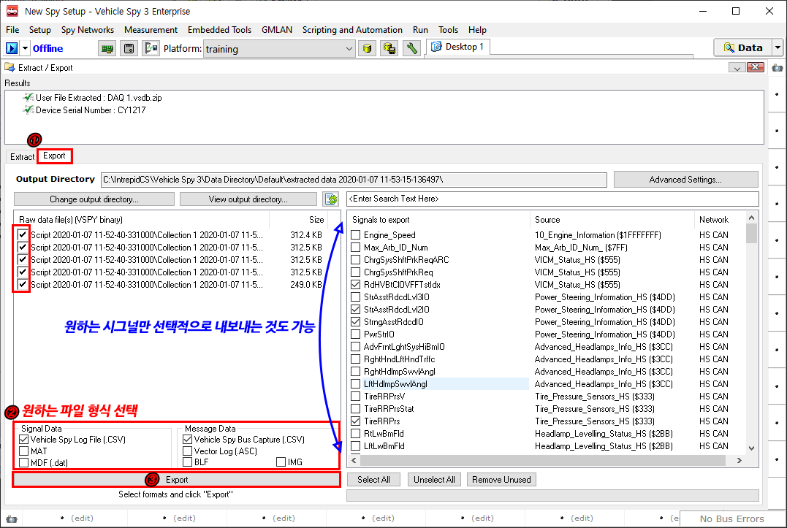

# 추출된 VSB 파일을 CSV, DAT, BLF 등의 파일 형식으로 내보내기

데이터를 추출시 기본 Vehicle Spy 형식인 VSB 포맷으로 추출됩니다. 이 형식을 csv, dat, blf 등의 원하는 형식으 로 변환하여 내보낼 수 있습니다.

1. Extract/Export 메뉴 내 Export 탭으로 이동합니다.
2. 원하는 파일 형식을 ‘Signal Data’나 ‘Message Data’에서 선택합니다. ‘Signal Data’를 선택 시 오른쪽 화면 에서 원하는 신호를 선택적으로 내보낼 수 있습니다.
3. Export 버튼을 누르면 Output Directory 경로에 지정된 형식으로 파일이 저장됩니다. View Output Directory 버튼을 눌러 저장 경로를 열 수 있습니다.

<figure><figcaption></figcaption></figure>
