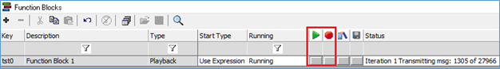

# 메세지 데이터 저장 파일 송신(Playback)

메세지 데이터를 저장한 파일(\*.csv, \*.vsb, \*.snp, \*.log, \*.asc, \*txt, \*.dat, \*.img, \*.blf)을 저장 된 메세지의 순서대 로 저희 장비에서 송신메세지를 보내주는 방법을 소개합니다. 즉, 실제 차량의 데이터를 사용하게 되면 차량에 연결된 것과 동일한 메세지를 개발중인 장비로 보내어 테스트할 수 있습니다.

먼저 ‘Scripting and Automation’에서 ‘Function Blocks’로 이동합니다. 이동 후 ‘+’버튼을 누르고 ‘Playback’을 선 택합니다. 그러면 Function Block이 생성되면서 Type에 ‘Playback’으로 표시됩니다. 그리고 아래 부분에 있는 ‘buffer’라는 항목에 ‘Browse…’버튼을 눌러 메세지 데이터를 저장한 파일을 등록해 줍니다. 그리고 시작을 어떻 게 할 것인지 설정을 할 ‘Start’ 항목으로 이동합니다. 그러면 기본적으로 아래와 같이 ‘Start Immediately’로 설정 되어 있습니다.

<figure><figcaption></figcaption></figure>

각 항목이 의미하는 바는 다음과 같습니다.

* Start Immediately: Online과 동시에 등록한 데이터파일 메세지가 전송되는 방식
* Manual Start: 내가 직접 시작하는 시점과 끝나는 시점을 정하는 방식
* Use Start Expression: 아래와 같이 특정 수식이 참이 되었을 때 동작하는 방식

<figure><figcaption></figcaption></figure>

* Start Immediately Embedded Only: 장비에 직접 이 Function Block을 넣은 후 장비에서만 전원이 들어 왔 을 때 바로 동작하는 방식(PC에서는 동작하지 않음) ‘Manual Start’에서 직접 동작을 시키는 방법에는 아래처럼 시작 버튼과 멈추는 버튼을 눌러서 직접 제어할 수 있고 ‘Start/Stop Hotkey’를 이용하여 해당 키 를 눌러서 제어하거나 ‘Graphical Panels’에서 제어하는 방법이 있습니다.

<figure><figcaption></figcaption></figure>

그래서 Playback Function Block이 실행이 되면 ‘Running’항목이 위의 그림처럼 ‘Running’으로 표시가 되고 ‘Messages’ 창에서 보면 아래와 같이 메세지들이 송신되고 있는 것을 확인하실 수 있습니다.

<figure><figcaption></figcaption></figure>
