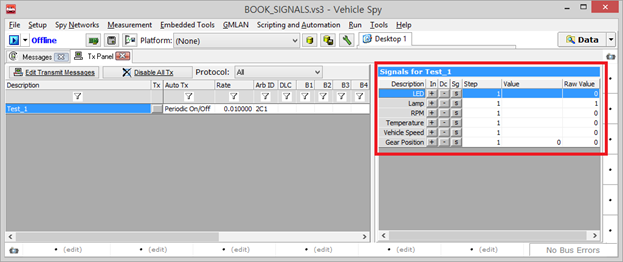
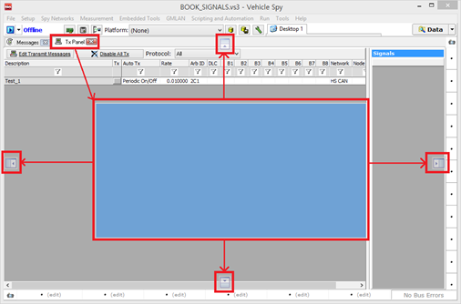
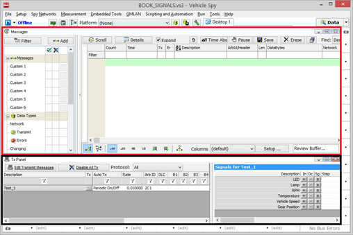

# 송신 메세지 보내는 방법

메세지를 송신하는 방법을 소개합니다.

먼저 ‘Messages Editor’에서 ‘Transmit’으로 이동합니다. 그리고 나서 이전 과정에서 설명한 '1. 수신 메세지 생성 및 DBC 파일 생성’을 참고하여 동일한 방법으로 송신할 메세지와 신호를 생성하여 설정합니다.

메세지에 들어갈 모든 정보를 입력한 후 ‘Spy Networks’에서 ‘Tx Panel’로 이동합니다. 이 창은 메세지를 송신하 는 창으로 ‘Message Editor’ 창에서와 동일하게 ‘Description’과 ‘ArbID’의 값을 수정할 수 있으며 ‘B1’-’B8’의 항목 에 직접 숫자를 입력할 수도 있습니다. 먼저 ‘Online’상태에서 원하는 메세지의 ‘Tx’항목에 있는 버튼을 누르게 되면 메세지가 보내지게 됩니다. 즉, 버튼을 한번 누를 때마다 한번씩 메세지가 보내지게 됩니다.

버튼을 눌렀을 때 특정 주기로 메세지가 보내지도록 설정 하고자 한다면 ‘Auto Tx’항목에 기본으로 설정되어 있 는 ‘Periodic’을 ‘Periodic On/Off’로 바꾼 다음 ‘Rate’항목에 ‘None’으로 되어있는 곳에 원하는 주기 값(초)을 입력 해줍니다. 그러면 ‘Online’한 후 ‘Tx’버튼을 누르게 되면 버튼이 눌려진 형태로 계속 유지가 되면서 설정한 주기 마다 메세지가 나가게 됩니다.

또한 해당 메세지의 신호 값들은 ‘Tx Panel’의 오른쪽에 ‘Signals’항목에 보여지게 되고 아래와 같이 ‘Value’값에 직접 입력하거나 ‘In’(+)와 ‘Dc’(-)버튼을 이용하여 Step에 값만큼 증가시키거나 감소시킬 수 있습니다.

<figure><figcaption></figcaption></figure>

그리고 ‘Sg’의 항목을 이용하여 특정 주기로 된 신호를 보내실 수도 있습니다. (위에서 보시면 현재 ‘Periodic On/Off’로 선택되어 있고 주기가’0.01’초로 설정되어 있습니다.)

여기에서 편리하게 사용하기 위해 두 가지 창을 동시에 보는 방법은 원하는 창의 이름 부분을 마우스로 클릭한 상태에서 원하는 쪽으로 이동하면 됩니다.

<figure><figcaption></figcaption></figure>

위와 같이 하면 아래 그림처럼 ‘Messages’ 창과 ‘Tx Panel’ 창을 한 화면에서 사용할 수 있습니다.

<figure><figcaption></figcaption></figure>
