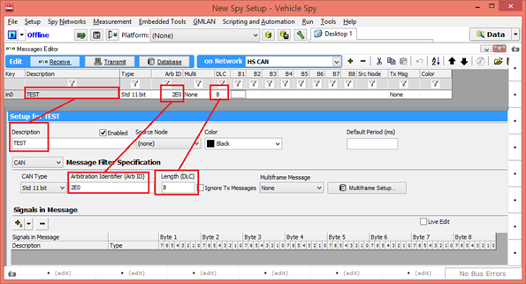
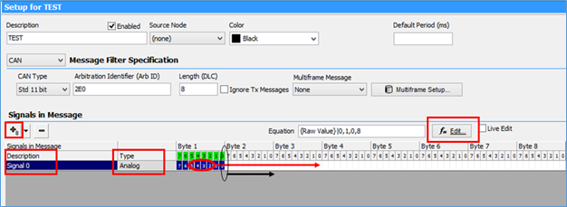

# 수신 메세지 생성 및 DBC 파일 생성

수신 메세지와 그 신호를 정의하여 실제 메세지가 수신했을 때 정의한 것으로 표현되게 하는 방법과 그 정의한 메세지들을 DBC파일로 만드는 방법에 대해서 소개합니다. DBC파일을 가지고 있다면 그대로 사용할 수 있지만 DBC파일이 없고 그 정보만 가지고 있거나 DBC파일을 만들고자 할 때 해당 방법을 이용하면 손쉽게 사용할 수 있습니다. 먼저 ‘Messages Editor’에서 ‘Receive’로 이동합니다. 메세지를 생성하기 위해서 상단의 ‘+’버튼을 누 릅니다. 그곳에서 해당 메세지의 이름과 ‘Arbitration ID(ArbID)’, 메세지 데이터의 크기 등을 입력하거나 아래의 항목에서도 입력할 수 있습니다. (아래 그림 참조)

<figure><figcaption></figcaption></figure>

<figure><figcaption></figcaption></figure>

신호를 생성하기 위해서는 먼저 아래 ‘+’버튼을 누르면 신호가 하나 형성이 되고 그 신호의 이름과 타입을 설정 할 수 있습니다. 신호의 위치와 크기를 정하는 방법에는 2가지가 있습니다. 첫 번째 방법으로 신호의 위치는 위 에서와 같이 파란색으로 표시된 중앙부분을 마우스를 누른 상태에서 이동하여 정할 수 있고 크기는 파란색끝부 분을 눌러서 크기를 정할 수 있습니다. 두 번째 방법으로 버튼을 눌러서 시작점과 크기를 입력하는 곳에 직접 숫자를 입력하여 설정할 수 있습니다. 그리고 이곳에서 이 신호의 Format, 최대 최소값, 단위 값 등 다양한 정보 들을 입력할 수 있습니다. 또한 ‘Scaling’으로 이동하여 Scaling Type을 ‘Linear mX + b’로 선택하면 원하시는 대 로 스케일링 작업도 하실 수 있습니다. (현재 왼쪽 그림은 실제 들어오는 값에 0.2를 곱하고 10을 더하여 신호의 값이 표현되도록 되어 있고 아래 항목에서는 소수점 한자리의 값으로 신호를 표시하고 단위는 %로 설정되어 있습니다.)

<figure><figcaption></figcaption></figure>

이렇게 원하는 설정대로 다 선택한 뒤 ‘Online’을 눌러 ‘Messages’ 창에서 확인해 보면 해당 메세지와 신호가 설 정한 대로 보여지게 될 것입니다. 마지막으로 DBC파일을 만들려면 일단 위와 같이 DBC파일에 들어갈 모든 메 세지와 신호들의 정보를 설정한 다음 ‘Messages Editor’창의 상단에 있는 버튼을 누르면 됩니다.
