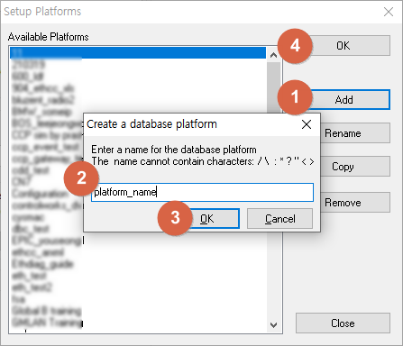
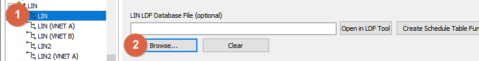
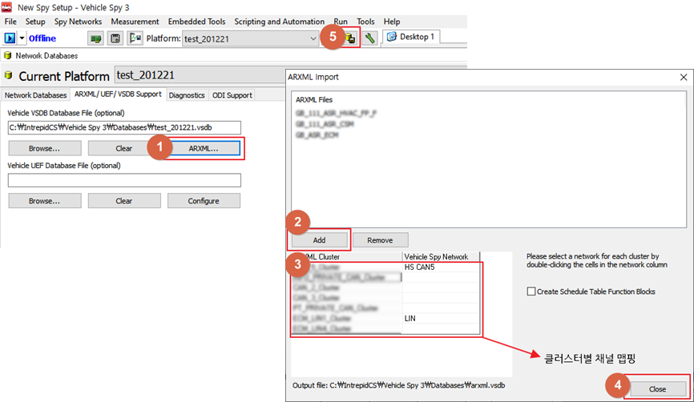

# 데이터베이스 플랫폼 생성 및 데이터베이스(.dbc, .ldf, .arxml) 등록

데이터베이스(.dbc/.ldf/.a2l 등) 파일을 등록하면 데이터를 의미있는 값으로 해독(Decoding)할 수 있습니다. 데이터베이스 파일이 없다면 이 단계는 넘어가셔도 됩니다.

데이터베이스 플랫폼은 데이터베이스 파일들의 묶음입니다. 이 플랫폼을 먼저 생성 후 해당 플랫폼에 데이터베이스 파일을 등록하면 됩니다.

1. 플랫폼을 생성하기 위해 상단 메뉴 바에서 를 클릭하거나 _Setup->Setup Platforms_로 이동합니다.
2.  _Add_ 버튼을 누른 뒤 플랫폼 이름을 입력하고 _OK_ 버튼을 차례로 클릭합니다. 플랫폼 이름은 차종으로 입력하면 관리하기 편리합니다.

    <figure><figcaption></figcaption></figure>
3. 상단 메뉴 바의 _Platform_을 2에서 설정한 플랫폼으로 설정합니다.\
   
4. 데이터베이스 파일을 등록하기 위해 을 클릭하시거나 _Setup->Network Databases_로 이동합니다.
5. CAN 통신을 사용하는 경우, 좌측에서 사용할 CAN 채널 선택 후 _Add..._, _DBC_ 버튼을 차례로 눌러 .dbc 파일을 등록합니다.&#x20;

<figure><figcaption></figcaption></figure>

&#x20; 6\. LIN 통신을 사용하는 경우, 좌측에서 사용할 LIN 채널 선택 후 _Browse..._ 버튼을 눌러 .ldf 파일을 등록합니다.&#x20;

<figure><figcaption></figcaption></figure>

&#x20;  7\. ARXML 파일을 가지고 계신 경우, 상단의 _ARXML/UEF/VSDB Support_ 탭에서 _ARXML.._ 버튼을 눌러 등록합니다.

<figure><figcaption></figcaption></figure>

&#x20;  8\. 파일 등록이 끝났으면 빨간색 박스가 깜빡는 .png>) 버튼 또는 .png>)를 눌러 플랫폼 설정을 저장합니다.

데이터베이스 등록 이후에는 _Spy Networks->Messages Editor_ 메뉴의 _Database_ 탭에서 등록한 데이터베이스에 정의된 내용을 확인할 수 있습니다. 이 메뉴는 읽기 전용으로 데이터베이스 편집을 원하시면 [DBC 파일을 편집하는 방법](../자주-묻는-질문\(FAQ\)/DBC-파일을-편집하는-방법.md)를 참고하시기 바랍니다.
