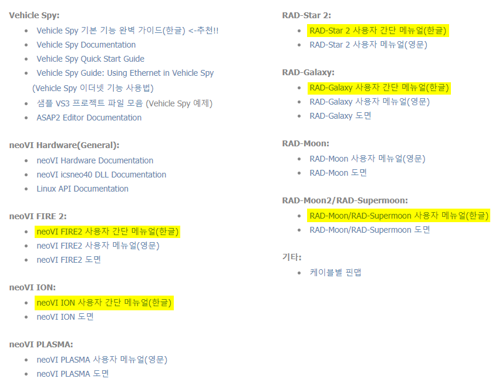

# 하드웨어 설정

[링크](https://www.intrepidcs.co.kr/support\_resources.html)의 장비별 사용자 간단 메뉴얼을 참조하여 장비를 올바르게 연결한 후 진행합니다.

장비마다 상이하지만 보통 25pin 또는 26pin 커넥터 쪽으로 12V 전원을 인가해주시고 USB 케이블(Rad-Galaxy 는 이더넷 케이블)을 사용하여 PC와 연결하시면 됩니다. 케이블별 핀맵은 [여기](http://www.intrepidcs.co.kr/uploads/2/5/0/1/25016645/icsk\_%EC%BC%80%EC%9D%B4%EB%B8%94%EB%B3%84\_%ED%95%80%EB%A7%B5.pdf)에서 확인 가능합니다.

<figure><figcaption></figcaption></figure>

CAN이나 LIN 통신 사용 시에는 아래 절차에 따라 장비의 Baud Rate을 알맞게 설정해주세요. Baud Rate은 연결 하려는 ECU(DUT) 장비와 동일하게 설정합니다.

Vehicle Spy 3 상단 메뉴바의 를 누르시거나 Setup->Hardware로 들어갑니다.

<figure><figcaption></figcaption></figure>

1. 연결된 장비 이름을 선택합니다.
2. ‘Connect’ 버튼을 누릅니다.
3. 설정 변경을 원하시는 네트워크를 선택합니다. (ex. HS CAN)
4. 해당 통신의 사용하는 경우 "Enabled"를 체크하고 Baud Rate을 알맞게 설정합니다.
5. ‘Write Settings’ 버튼을 누르면 Hardware Setup에서 변경한 내용이 저장됩니다. (창 오른쪽 아래의 파란색 문구를 확인해주세요.)

이 설정은 하드웨어에 저장 되는 설정으로 처음 한 번만 설정하시면 됩니다. 또한 사용하시려는 Baud Rate이 장 비 Default Baud Rate과 동일하다면 설정을 변경하지 않아도 됩니다.

※ [‘Hardware Setup’ 사용법 영상](http://screencast-o-matic.com/watch/coiwnsfw9P)
