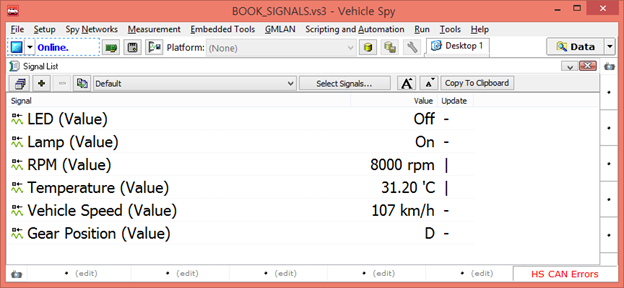

# 실시간 신호 값 보기

실시간으로 선택한 신호들의 값을 확인하는 방법에 대해서 소개 합니다. 먼저 ‘Measurement’에서 ‘Signal List’로 이동합니다. 그리고 신호들을 선택하기 위해서 ‘Select Signals…’ 버튼을 누릅니다. 그리고 난 후 Page 9 를 참조하여 원하시는 신호들을 선택합니다. 선택이 끝나면 ‘Online’ 을 하여서 선택한 신호들의 값을 확인하면 됩니다. 그리고 와 버튼을 이용하여 글자 크기를 조정할 수 있습니다.

<figure><figcaption></figcaption></figure>

위의 그림에서 ‘Signal List’창의 ‘Update’ 항목은 해당 신호를 포함한 메세지가 수신되거나 송신 될 때 ‘–‘ ‘|’ ‘/’ ’\’ 이렇게 변경이 되면서 신호들이 실시간으로 송·수신 되는 것을 확인할 수 있습니다. (선택한 신호를 가진 메세지가 송 수신되지 않는다면 해당 항목은 멈춰있게 됩니다.)
