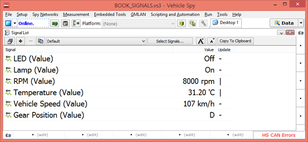

# 실시간 신호 값 보기

실시간으로 선택한 신호들의 값을 확인하는 방법에 대해서 소개 합니다.&#x20;

1. 상단 메뉴바에서 _Measurement->Signal List_로 이동
2. .png>) 버튼을 눌러 원하는 신호들을 선택합니다.&#x20;
3. Online을 하여서 선택한 신호들의 값을 확인하면 됩니다.&#x20;

와 버튼을 이용하여 글자 크기를 조정할 수 있습니다.

<figure><figcaption></figcaption></figure>

위의 그림에서 ‘Signal List’창의 ‘Update’ 항목은 해당 신호를 포함한 메세지가 수신되거나 송신 될 때 ‘–‘ ‘|’ ‘/’ ’\’ 이렇게 변경이 되면서 신호들이 실시간으로 송·수신 되는 것을 확인할 수 있습니다. (선택한 신호를 가진 메세지가 송 수신되지 않는다면 해당 항목은 멈춰있게 됩니다.)
