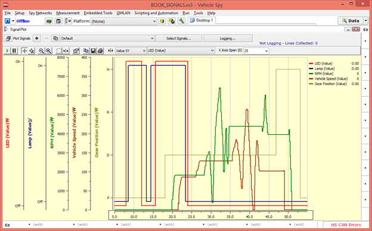

# 실시간 신호 그래프 보기

실시간으로 선택한 신호들의 그래프를 확인 하는 방법에 대해서 소개합니다.&#x20;

1. 상단 메뉴바에서 _Measurement->Signal Plot_으로 이동
2.  버튼을 눌러 원하는 신호들을 선택합니다.&#x20;
3. Online을 하여서 선택한 신호들의 그래프를 확인합니다. &#x20;

<figure><figcaption></figcaption></figure>

처음 신호를 선택하면 위와 같이 신호가 겹쳐서 나오게 됩니다. 각각의 그래프로 값을 확인하고 싶거나 그래프 의 색깔 굵기 등 다양한 정보들을 변경하는 곳은 버튼을 누르면 됩니다. 이 버튼을 눌러 그래프의 선 굵기와 색 깔 표시방법 등은 ‘Channels’에서 설정하실 수 있고 신호를 따로 보기를 하기 위해서는 ‘Plot’ 항목으로 가서 ‘Stack Legend’체크 박스를 선택하시면 됩니다. 또한 위와 같이 신호들의 값도 나타내고자 한다면 ‘Show Legend’체크 박스를 선택하면 됩니다. 그리고 X축 범위 설정은 ‘X Axis Span(S)’값에 원하시는 시간(초)을 입력 하면 되고 Y축의 범위를 자동으로 설정하고 싶다면 Y축에서 마우스 오른쪽 버튼을 눌러 ‘Zoom to Fit’을 선택하 면 자동으로 Y축이 조정됩니다.

※ [신호 분석 사용법 동영상](http://screencast-o-matic.com/watch/colii4htFp)
