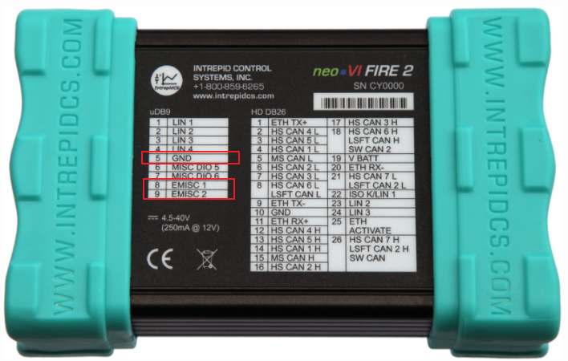
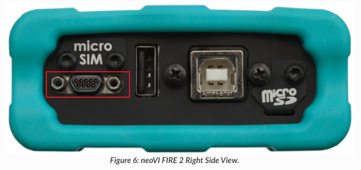
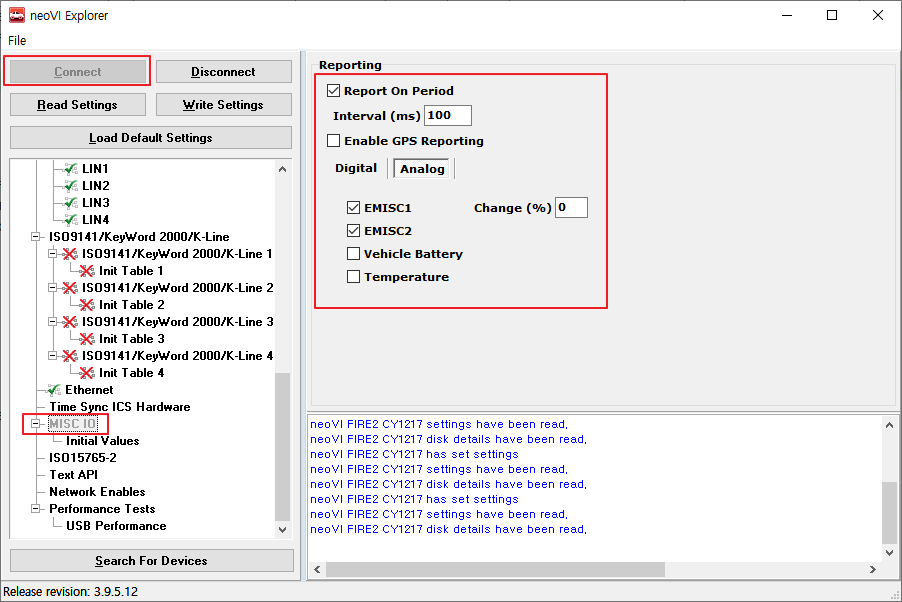
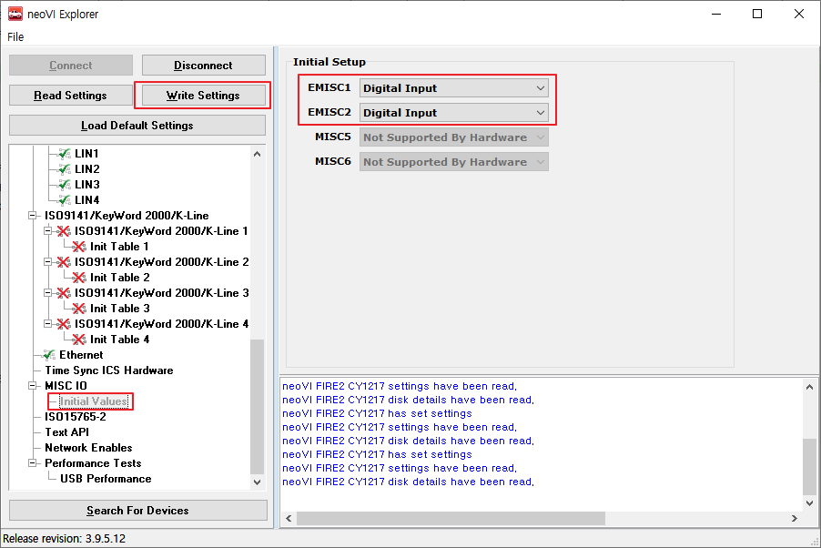
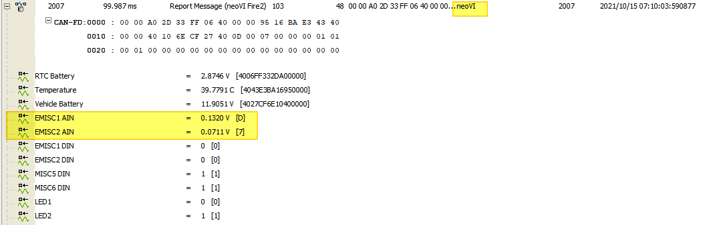

# neoVI FIRE2를 이용한 아날로그 값 측정법(eMISC 사용법)

아날로그 값 측정은 FIRE2 장비의 마이크로 9핀을 이용합니다. 8/9번 두 채널이 있으며 5번이 그라운드입니다. 측정 가능한 범위는 0\~40V이며 resolution은 12bit입니다.

 

FIRE2 장비 설정은 다음과 같이합니다.

Vehicle Spy 상단 메뉴바  클릭 > 좌측에서 장비 선택 후 Connect 클릭 > MISC IO와 Initial Values 옵션을 다음과 같이 설정 > Write Settings 클릭

 

이후 시그널 값은 neoVI 채널(HS CAN 채널 X)의 Report Messages 메세지 안의 EMISC1 AIN, EMISC2 AIN 시그널로 수신됩니다.

