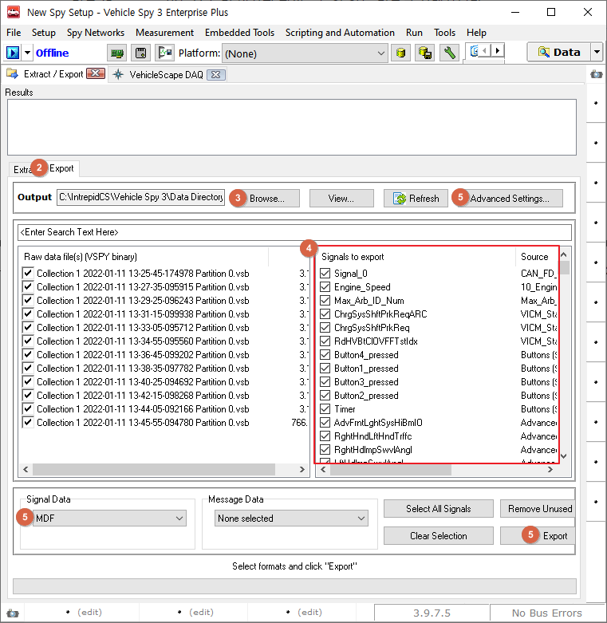

# VSB에서 MDF(.dat, .mdf, .mf4) 포맷으로 변환

mdf 파일은 시그널 형식의 파일로 vsb 파일을 mdf 파일로 변환하기 위해서는 Vehicle Spy 데이터베이스 형식인 vsdb 파일이 필요합니다.

vsdb 파일을 생성하는 방법은 다음과 같습니다.

* PC 없이 장비 단독으로 로깅하신 경우: 장비에서 로그파일을 추출하면 vsdb 파일이 로그 파일(vsb)과 함께 추출됩니다.
* PC에서 로깅 하셨거나, vsb 파일만 단독으로 가지고 계신 경우: 아래 방법으로 vsdb 파일을 생성합니다.

1. [데이터베이스 플랫폼 생성 및 데이터베이스(.dbc, .ldf, .arxml) 등록](../../시작하기/데이터베이스-플랫폼-생성-및-데이터베이스-dbc-ldf-arxml-등록.md)을 참고하여 데이터 베이스를 등록합니다. 이때 로그 파일 상의 채널 번호와 데이터베이스 상의 채널 번호가 일치하는지 확인합니다.
2. Measurement->Vehiclescape DAQ->Standalone Logging 탭에서 설정 변경 없이 하단의 Generate 버튼을 누릅니다. CoreMini Executable Generator 창이 뜨면 아무것도 누르지 않고 다시 닫습니다.
3. 오른쪽 상단의 .png>)를 누르면 DAQ 1.vsdb 파일이 생성되는 경로가 열립니다.

변환하는 방법은 다음과 같습니다.

1. 변환할 파일(vsb) 있는 폴더에 앞서 만든 DAQ 1.vsdb 파일을 복사합니다.
2. Tools->Extract/Export에서 Export탭으로 이동합니다.
3. Output 경로 옆 Browse...버튼을 눌러 변환할 파일(vsb)이 있는 경로를 선택합니다.
4. 화면 우측에 데이터베이스 내 시그널 목록이 표시되며 로그 파일 안에 존재하는 시그널이 모두 자동으로 체크됩니다. 일부 시그널만 추출할 경우 추출을 원하는 시그널만 선택합니다.
5. 왼쪽 하단 Signal Data 드롭다운에서 MDF체크 후 Export를 누르면 변환됩니다. 기본 .dat 파일로 추출되며 오른쪽 상단 Advanced Settings...->Export탭에서 .mdf, .mf4 등으로 변경 가능합니다.&#x20;

<figure><figcaption></figcaption></figure>
