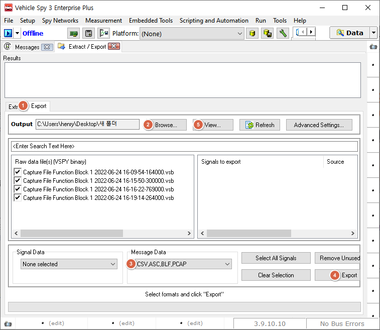

# VSB에서 .csv, .asc, .blf 등의  포맷으로 변환

### 하나의 VSB만 변환

Tools->File Conversions에서 아래와 같이 csv, asc, blf 등의 파일 변환 기능을 제공하고 있습니다.

<figure><figcaption>
Tools->File Conversions
</figcaption></figure>

### 여러 개의 VSB을 한꺼번에 변환

1. _Tools->Extract/Export_에서 _Export_탭으로 이동합니다.
2. Output 경로 옆 _Browse..._버튼을 눌러 변환할 파일(vsb)이 있는 경로를 선택합니다.
3. 원하는 파일 형식을 _Message Data_ 드롭다운에서 선택합니다.&#x20;
4. _Export_ 버튼을 누르면 _Output_ 경로에 지정된 형식으로 파일이 저장됩니다.&#x20;
5. _View..._ 버튼을 눌러 저장 경로를 열 수 있습니다.

<figure><figcaption>
Tools->Extract/Export->Export 탭
</figcaption></figure>
