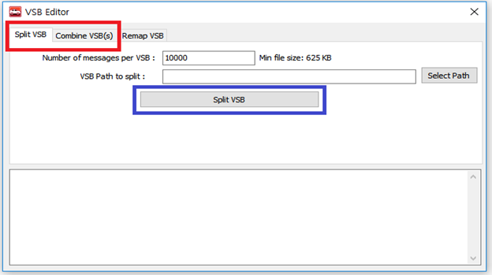
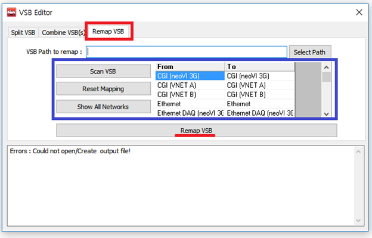

# Logging 데이터 통합/분할/맵핑 (VSB Editor)

Vspy3를 통해 로깅한 파일(.vsb)의 데이터 용량이 큰 경우, 분석하는데 불편함을 초래할 수 있습니다. 반대로, 데이터가 여러 파일로 분산된 경우 분석하는데 용이하지 않습니다. 이런 경우, Vspy3의 VSB Editor를 이용해 파일을 Combine/Split 할 수 있습니다. 방법은 다음과 같습니다. 
a.	Tools > File Conversions > VSB Editor클릭
 
b.	Split/Combine tab 선택 후, Select Path를 이용해 작업을 수행할 VSB를 선택 및 
Split/Combine button 클릭

추가적으로, VSB Editor에서는 맵핑(Mapping)이라는 기능을 제공하고 있습니다. 로깅한 파일의 차량 네트워크를 사용자의 환경에 맞게 다시 맵핑(Remapping)할 수 있는 기능입니다. VSB Editor의 Remap VSB를 통해 네트워크를 수정할 수 있습니다. 

1. Select Path클릭, 수정할 VSB 선택
2. Scan VSB 클릭하여 내용 불러오기
3. To tab의 네트워크 더블 클릭 후, 수정
4. Remap VSB 클릭하여 변경 내용 적용

