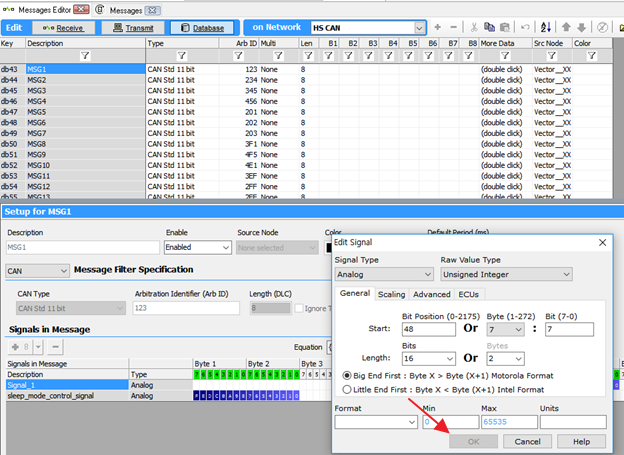
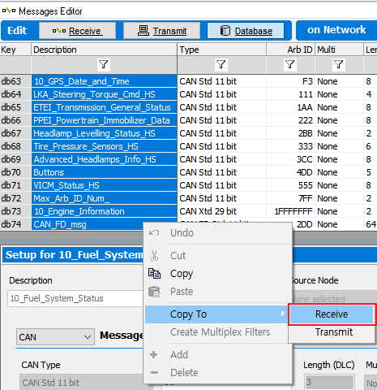
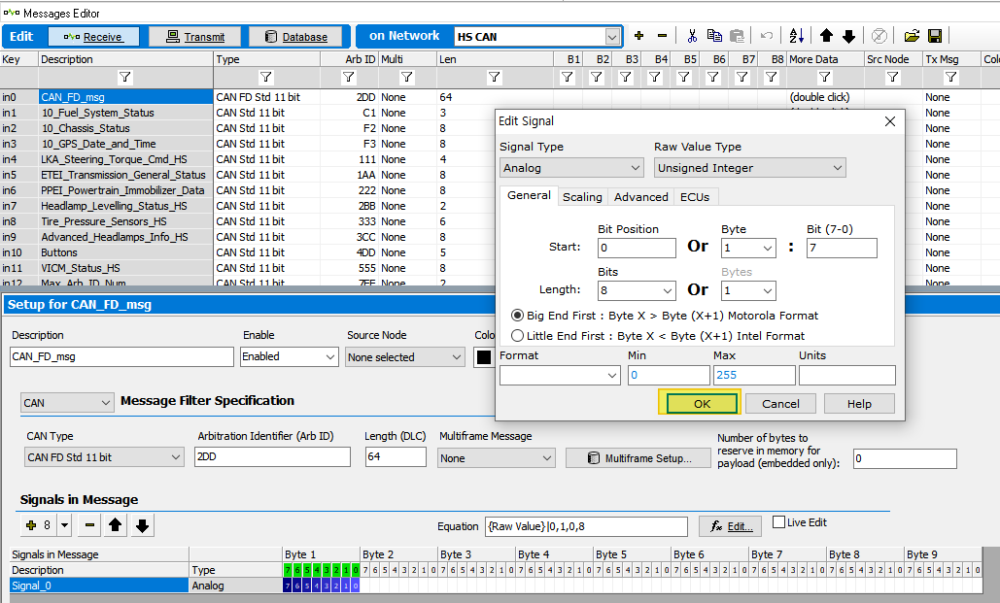

# DBC 파일을 편집하는 방법

Vehicle Spy를 통해 가지고 계신 DBC의 정보를 수정 후 새로운 dbc 파일로 저장할 수 있습니다. 

1. 수정하고자 하는 DBC 파일을 등록합니다. DBC 파일 등록법은 [여기](#12-데이터베이스-플랫폼-생성-및-데이터베이스dbc-ldf-arxml-등록)에 소개되어있습니다.

2.	Spy Networks->Messages Editor 메뉴의 Database 탭에서 등록한 DBC에 정의된 내용을 확인할 수 있습니다. 그러나 아래 그림과 같이 수정할 수 없도록 Edit Signal 창의 OK 버튼이 비활성화되어 있습니다. 
 

3.	Shift+클릭을 이용해 데이터 베이스 메세지를 전체 선택 한 후 마우스 우클릭 Copy To Receive를 선택합니다.

4. Receive 탭으로 이동 후 복제된 메세지들을 원하시는 대로 수정합니다. 수정 방법은 [여기](#41-수신-메세지-생성-및-dbc-파일-생성)를 참고하시기 바랍니다.  
 

5. 수정이 끝난 후 Messages Editor 메뉴 상단의  버튼을 누른 뒤 새로운 DBC 파일로 저장합니다.
