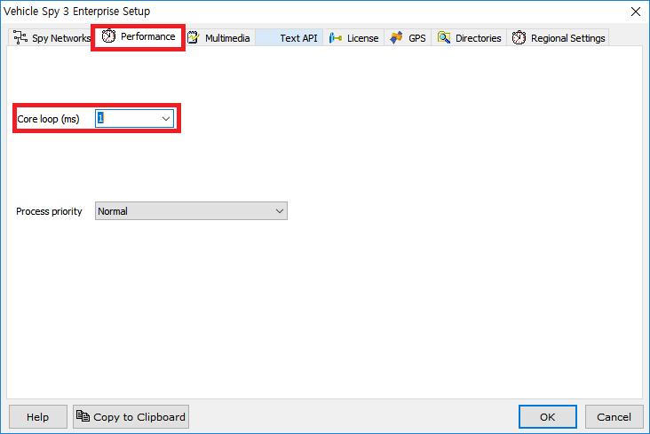
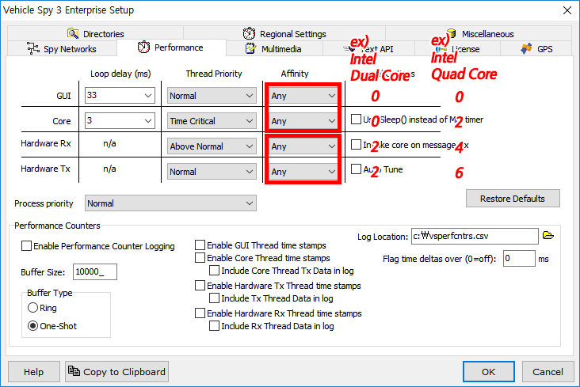

# Vehicle Spy 퍼포먼스 개선 옵션

저사양 PC에서 Vehicle Spy를 구동하시거나, Tx panel을 이용하여 메세지 송신시 설정한 주기보다 송신 되는 메세지 주기가 길어지는 경우 다음과 같은 방법으로 소프트웨어 퍼포먼스를 개선하실 수 있습니다. 

1. Tools->Options에서 아래와 같이 Core loop 시간을 1ms로 조정해주세요.

추가적으로 속도 향상을 원하시면 아래 옵션을 추가로 변경해주세요. 
(이 추가 옵션은 vehicle spy를 두 개 이상 실행시에는 효과가 없습니다.)

2. Tools->Options의 Performance탭에서 Core loop 글자를 더블 클릭하시면 아래와 같은 창이 뜹니다. 
Affinity 설정을 통해 Vehicle Spy 각 기능마다 어떤 CPU 코어를 쓸지 할당 할 수 있습니다. 예를 들어 인텔사 듀얼코어는 0,2번이 실제 코어이고 1,3번은 hyperthread입니다. 이 경우 GUI와 Core에 같은 코어(0)를 그리고 Hardware Rx와 Hardware TX에 같은 코어(2)를 할당하시는 것을 추천드립니다. 인텔사 쿼드코어를 사용 중이시라면 각각에 0,2,4,6번 코어를 할당하시면 됩니다. 

