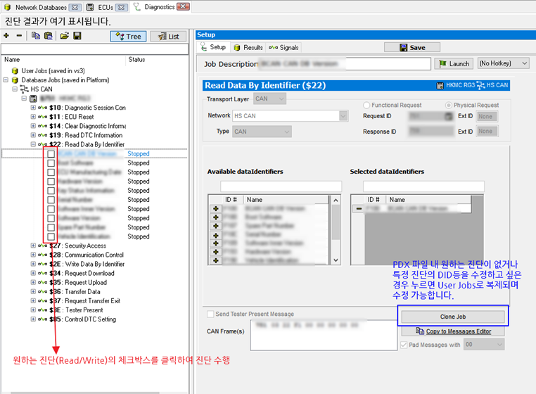

# Diagnostics 메뉴를 이용한 UDS 진단

진단 통신 변수 모니터링과 같은 방법이 아니라 개별적으로 UDS 진단 Request를 수행하고 싶을 때에는 아래 절차를 따르면 됩니다.

1. Spy Networks->Diagnostics 메뉴로 이동합니다.
2. 등록한 데이터베이스 파일 내에 진단 수행에 대한 정보가 있으면 좌측에 Database Jobs 목록에 표시됩니다. 원하는 진단의 체크 박스를 클릭하여 진단을 수행하면 상단에 진단 결과가 표시됩니다.

<figure><figcaption></figcaption></figure>

