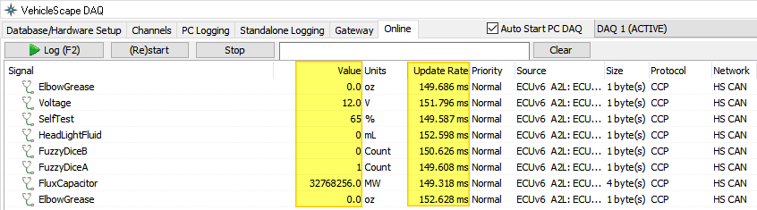

# 진단 통신 변수 모니터링

Vehicle Spy는 진단 통신 변수를 주기적으로 취득할 수 있도록 도와줍니다.

1. _Measurement->Vehicle Scape DAQ_로 이동합니다. 또는 아래의 _File->Logon_ 화면에서 _VehicleScape DAQ_ 버튼을 클릭합니다.

<figure><figcaption>
File-Logon
</figcaption></figure>

2\. _Channels_ 탭에서 읽을 변수를 추가합니다. _Clear_ 버튼을 누르면 하단 _Results_ 창에 현재 등록된 플랫폼내의 모든 변수가 출력됩니다. 또는 검색된 변수의 목록이 출력됩니다. 로깅을 원하는 변수를 더블 클릭 또는 드래그로 다중 선택하여 _Selected>>_ 버튼을 누르면 변수들이 우측 _Selected Channels for Test_에 추가 됩니다.

&#x20;3\. 상단의 Polling setup에서 변수 취득 주기를 설정하고 변수들을 우클릭하여 Rate를 Low/Normal/High 중 하나로 선택합니다. CCP/XCP 변수를 Event 방식으로 받는 경우 변수들을 우클릭 후 Rate->CCP/XCP DAQ Events에서 Event를 지정합니다. Event별로 할당할 수 있는 ODT 수가 정해져 있으므로 메뉴 우측 하단의 표를 참고하여 이를 초과하지 않도록 지정합니다.

<figure><figcaption>
<em>Measurement->Vehicle Scape DAQ->Channels 탭</em>
</figcaption></figure>

&#x20; 4\. Online 탭으로 이동하면 변수값이 표시됩니다. 변수값이 나오지 않은 경우 (Re)start 버튼을 누릅니다.

<figure><figcaption>
<em>Measurement->Vehicle Scape DAQ->Online 탭</em>
</figcaption></figure>

이어서 장비 단독 변수 로깅은 [여기](../데이터-로깅/장비-단독으로-메세지-저장법.md)를 참고하시기 바랍니다.
