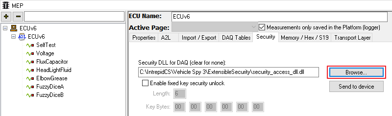

# CCP/XCP 데이터베이스 등록

CAN Calibration Protocol(CCP) 또는 Universal Calibration Protocol(XCP) 진단 통신을 통해 차량 메모리 변수값을 읽고 로깅할 수 있습니다. 이 통신을 하기 위해서는 A2L 파일이 반드시 필요하며 경우에 따라 Security Access용 dll 파일이 추가로 필요합니다.

1. [데이터베이스 플랫폼을 생성](../../시작하기/데이터베이스-플랫폼-생성-및-데이터베이스-dbc-ldf-arxml-등록.md)하거나 상단 바의 _Platform_ 드롭다운 메뉴에서 기존의 플랫폼을 지정합니다.
2. _Mesurement->MEP_ 메뉴 왼쪽 상단의 .png>)를 클릭, _Add for Measurement/Logging_을 클릭하여 A2L 파일을 등록합니다.
3. 좌측에 등록된 제어기 목록이 표시됩니다. Security Access가 필요한 제어기인 경우 좌측에서 ECU 선택, _Security_ 탭에서 _Browse..._버튼을 눌러 dll 파일을 등록합니다. 장비 단독 로깅을 할 때에는 _Send To Device_ 버튼을 눌러 dll 파일을 장비에 심어줍니다.

<figure><figcaption></figcaption></figure>

&#x20;4\. 파일 등록이 끝났으면 빨간색 박스가 깜빡 거리는  (2).png>)버튼 또는  (1).png>)를 눌러 플랫폼 설정을 저장합니다.
