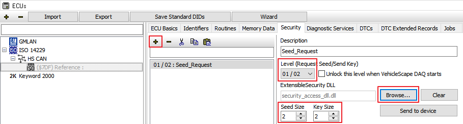

# ISO14229(UDS) 데이터베이스 등록

&#x20;ISO14229(UDS) 진단 통신을 통해 차량의 VIN, DTC, DID, PID 등의 정보를 읽거나 변경할 수 있습니다. 이 통신 을 하기 위해서는 ODX, CDD 등의 진단 데이터베이스 파일 또는 관련 스펙(진단 ID, 진단 서비스 ID 등)이 필요 합니다. 경우에 따라 Security Access용 dll 파일이 추가로 필요합니다.

1. [데이터베이스 플랫폼을 생성](../../시작하기/데이터베이스-플랫폼-생성-및-데이터베이스-dbc-ldf-arxml-등록.md)하거나 상단 바의 Platform 드롭다운 메뉴에서 기존의 플랫폼을 지정합니다.
2. 상단 메뉴 바의 를 누르거나 Spy Networks->ECUs 메뉴로 이동합니다.
3. 진단용 데이터베이스 파일이 있는 경우 메뉴 상단의 Import->ISO14229 (UDS)에서 가지고 있는 파일 (ODX, CDD 등)을 등록합니다.
4. 좌측에 등록된 제어기 목록이 표시됩니다. Security Access가 필요한 제어기인 경우 좌측에서 ECU 선택, Security 탭에서 Browse...버튼을 눌러 dll 파일을 등록하고 Level과 Seed Size/Key Size를 설정합니다.

<figure><figcaption></figcaption></figure>

&#x20; 5\. 파일 등록이 끝났으면 빨간색 박스가 깜빡 거리는 .png>)버튼 또는 를 눌러 플랫폼 설정을 저장합니다.
